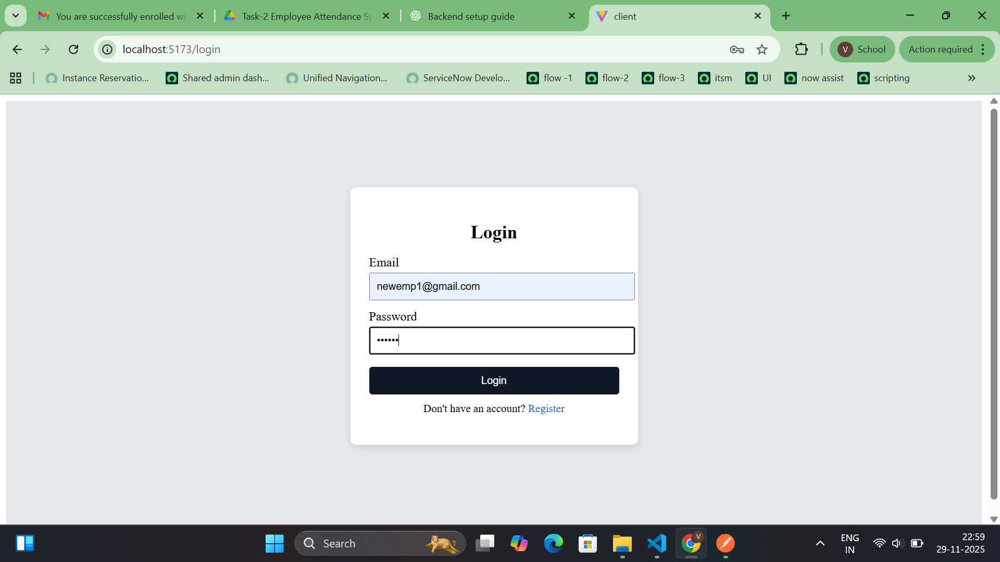
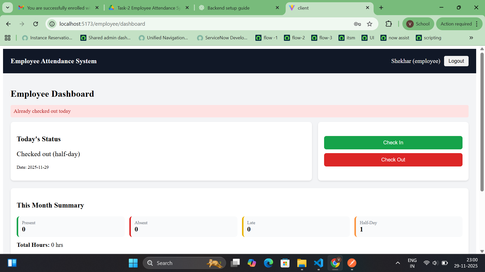
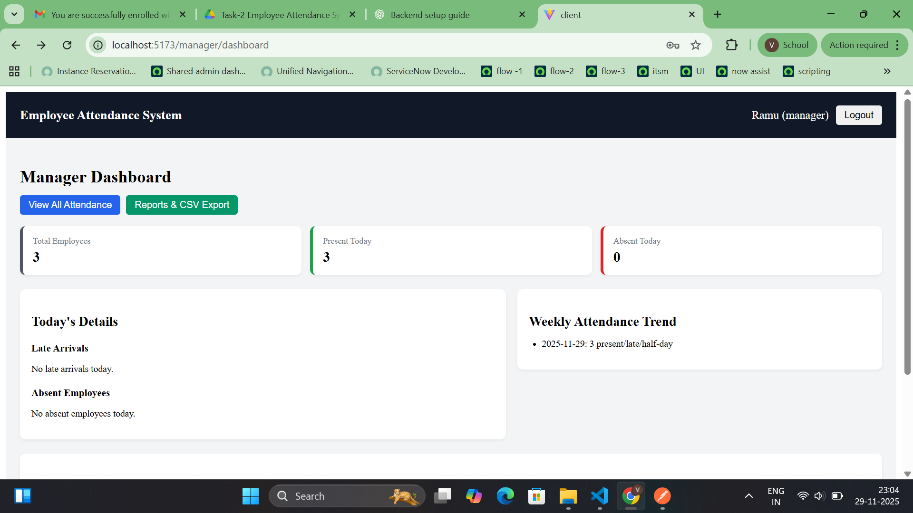
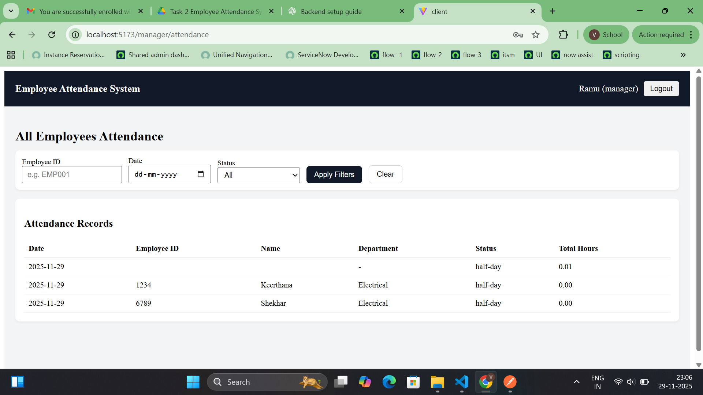
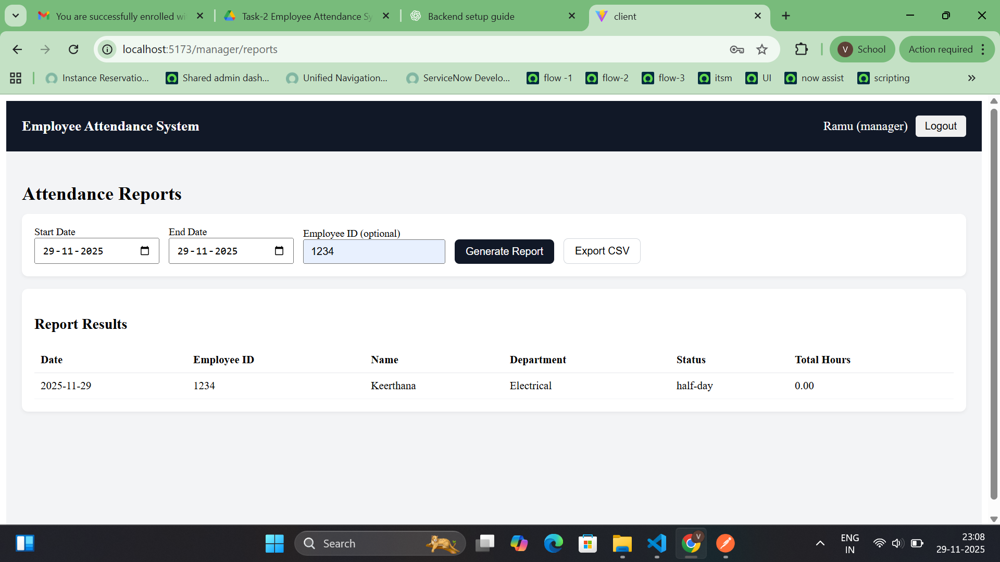

📘 Employee Attendance System

A full-stack attendance tracking system for employees and managers, built using MERN (MongoDB, Express, React, Node.js) with role-based authentication, dashboards, reports, calendar views, and CSV export.

🚀 Tech Stack
Frontend

React (Vite)

Redux Toolkit

Axios

Protected Routes

Calendar UI + Responsive Dashboards

Backend

Node.js

Express.js

MongoDB (Mongoose)

JWT Authentication

Role-based Middleware (Employee / Manager)

Features
👨‍💼 Manager

View all employee attendance

Filter by:

Employee ID

Date

Status

Full team summary

Department-wise analytics

Weekly trend

Late arrivals

Absent employees

Export attendance as CSV

Reports: date range + employee filter

👨‍🔧 Employee

Login / Register

Check In

Check Out

View today's status

Monthly attendance summary

Calendar view (present / absent / late / half-day colors)

Full attendance history

🛠️ Project Structure
employee-attendance-system/
│
├── backend/
│   ├── controllers/
│   ├── models/
│   ├── routes/
│   ├── middleware/
│   ├── utils/
│   ├── seed.js
│   ├── server.js
│   ├── .env.example
│
└── client/
    ├── src/
    │   ├── api/
    │   ├── components/
    │   ├── pages/
    │   ├── features/
    │   ├── App.jsx
    ├── .env.example

⚙️ Setup Instructions
1️⃣ Clone Repository
git clone <https://github.com/vandana89/employee-attendance-system>
cd employee-attendance-system

2️⃣ Backend Setup
cd backend
npm install

Copy env example:

cp .env.example .env

Set your MongoDB URI and JWT secret.

Run backend:

npm run dev

Should show:

MongoDB Connected
Server running on port 5000

3️⃣ Frontend Setup

Open a new terminal:

cd client
npm install

Copy env example:

cp .env.example .env

Run frontend:

npm run dev

Frontend URL:

http://localhost:5173

🌱 Seed Default Users (Optional)
cd backend
node seed.js

Default test accounts:

Manager

Email: manager@example.com

Password: Manager@123

Employee

Email: emp1@example.com

Password: Employee@123

📸 Screenshots Checklist 

## 🔥 Login Screen

## 👨‍🔧 Employee Dashboard

## 👨‍💼 Manager Dashboard

## 👨‍💼 Attendance Dashboard

## 📊 Reports Page

System:

Folder Structure

API Testing in Postman

Make your README look professional.

🧪 API Documentation (Short Summary)
Auth
POST /api/auth/register
POST /api/auth/login
GET  /api/auth/me

Attendance (Employee)
POST /api/attendance/checkin
POST /api/attendance/checkout
GET  /api/attendance/my-history
GET  /api/attendance/my-summary
GET  /api/attendance/today

Attendance (Manager)
GET /api/attendance/all
GET /api/attendance/report
GET /api/attendance/export

Dashboard
GET /api/dashboard/employee
GET /api/dashboard/manager

